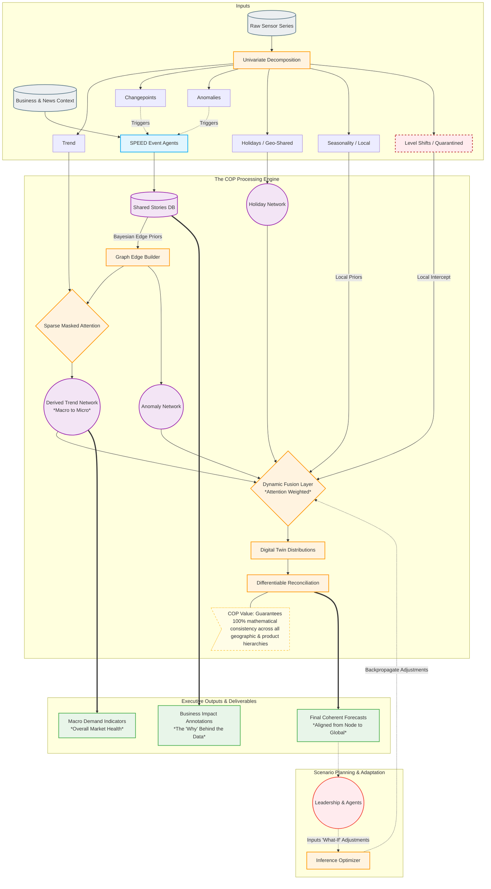

```mermaid
graph TB
    classDef input fill:#eceff1,stroke:#607d8b,stroke-width:2px;
    classDef processing fill:#fff3e0,stroke:#ff9800,stroke-width:2px;
    classDef agent fill:#e1f5fe,stroke:#03a9f4,stroke-width:2px;
    classDef core fill:#f3e5f5,stroke:#9c27b0,stroke-width:2px;
    classDef output fill:#e8f5e9,stroke:#4caf50,stroke-width:2px;
    classDef user fill:#ffebee,stroke:#f44336,stroke-width:2px;
    classDef strict fill:#ffebee,stroke:#b71c1c,stroke-width:2px,stroke-dasharray: 5 5;
    classDef note fill:#fffde7,stroke:#fbc02d,stroke-width:1px,stroke-dasharray: 5 5;

    %% --- THE DATA ENGINE ---
    subgraph Inputs
                Sensors[(Raw Sensor Series)]:::input --> Decomp[Univariate Decomposition]:::processing
        News[(Business & News Context)]:::input --> Agents[SPEED Event Agents]:::agent
        
        Decomp --> T[Trend]
        Decomp --> C[Changepoints]
        Decomp --> A[Anomalies]
        Decomp --> H[Holidays / Geo-Shared]
        Decomp --> S[Seasonality / Local]
        Decomp --> LS[Level Shifts / Quarantined]:::strict
    end
    subgraph Engine [The COP Processing Engine]
        direction TB
    
        
        C -.-> |Triggers| Agents
        A -.-> |Triggers| Agents
        Agents --> Stories[(Shared Stories DB)]:::core
        
        Stories --> |Bayesian Edge Priors| MaskBuilder[Graph Edge Builder]:::processing
        MaskBuilder --> SparseAttn{Sparse Masked Attention}:::processing
        
        T --> SparseAttn
        SparseAttn --> T_Graph((Derived Trend Network<br/>*Macro to Micro*)):::core
        MaskBuilder --> A_Graph((Anomaly Network)):::core
        H --> H_Graph((Holiday Network)):::core

        T_Graph --> Fusion{Dynamic Fusion Layer<br/>*Attention Weighted*}:::processing
        A_Graph --> Fusion
        H_Graph --> Fusion
        S --> |Local Priors| Fusion
        LS --> |Local Intercept| Fusion
        
        Fusion --> Twin[Digital Twin Distributions]:::processing
        Twin --> Recon[Differentiable Reconciliation]:::processing
        Recon --- Note>COP Value: Guarantees 100% mathematical consistency across all geographic & product hierarchies]:::note
    end

    %% --- THE EXECUTIVE VIEW ---
    subgraph Outputs [Executive Outputs & Deliverables]
        direction LR
        T_Graph ====> ExecTrends[Macro Demand Indicators<br/>*Overall Market Health*]:::output
        Stories ====> Annotations[Business Impact Annotations<br/>*The 'Why' Behind the Data*]:::output
        Recon ====> FinalForecast[Final Coherent Forecasts<br/>*Aligned from Node to Global*]:::output
    end

    %% --- SCENARIO PLANNING ---
    subgraph Scenarios [Scenario Planning & Adaptation]
        FinalForecast -.-> UserAgent((Leadership & Agents)):::user
        UserAgent -.->|Inputs 'What-If' Adjustments| Backprop[Inference Optimizer]:::processing
        Backprop -.->|Backpropagate Adjustments| Fusion
    end
```
